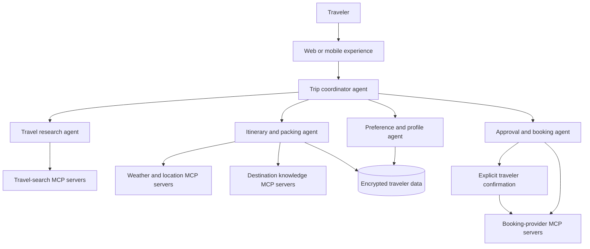

# Fernweh

Fernweh is the next iteration of PackMate: an MCP-enabled, agentic vacation assistant designed to help travelers move from an initial idea to a ready-to-go trip.

The project began as a personalized packing-list prototype. The new direction expands that useful starting point into an end-to-end travel workflow: understand a trip request, research options, build an itinerary, prepare a weather-aware packing plan, and guide the traveler through bookings with explicit approval at every purchase step.

> **Project status:** planning and rebuild phase. The folders in this repository contain legacy PackMate prototypes, not the new Fernweh implementation yet.

## Product Direction

Fernweh should act as a practical travel copilot rather than a chat interface that only gives suggestions. A traveler can describe a trip in natural language, refine constraints in conversation, compare researched options, and receive a coordinated plan.

The intended experience includes:

- Trip discovery from flexible requests such as destination ideas, dates, budget, interests, accessibility needs, and group preferences.
- Flight, hotel, ground-transport, and activity research through trusted external tools.
- Comparison of options using transparent trade-offs such as price, duration, location, cancellation terms, and traveler preferences.
- An itinerary that combines confirmed choices with useful local context.
- Personalized packing recommendations based on destination, trip length, weather, planned activities, and traveler details.
- Pre-departure reminders, packing checklist management, and itinerary updates when plans or conditions change.
- Booking assistance that prepares a checkout-ready selection but requires explicit traveler confirmation before any purchase or irreversible action.

## Agentic and MCP Architecture

Fernweh will use specialized agents coordinated by an orchestration layer. Model Context Protocol (MCP) servers provide well-defined, auditable access to travel and personal-data capabilities instead of embedding provider-specific integrations directly in agent prompts.



### Design Principles

- **Human approval for purchases:** Agents may search, filter, compare, and prepare an action, but never complete a booking without clear user confirmation.
- **Bounded tools:** Each MCP server exposes the minimum capabilities needed for its domain, with scoped credentials and structured inputs and outputs.
- **Traceable recommendations:** The app should show why an option was recommended and identify the data or constraints that influenced it.
- **Resilient execution:** Tool failures should be visible and recoverable; agents should not invent availability, prices, reservations, or weather data.
- **Privacy by default:** Traveler profiles, passports, payment details, and booking credentials require deliberate data handling and should not be placed in model prompts unnecessarily.

## Legacy PackMate Audit

The existing code is valuable as a reference for the packing portion of Fernweh. It is not a complete or currently production-ready end-to-end travel product.

| Area | Location | What was implemented |
| --- | --- | --- |
| Marketing frontend | [Packmate-Frontend/codathon-PackMate-main](Packmate-Frontend/codathon-PackMate-main) | A Create React App site with home, features, how-it-works, about, contact, and login routes. It presents the packing-assistant concept and links users to the Streamlit tool. |
| Packing experience | [Packmate-Streamlit/packmate-main/streamlitpackmate.py](Packmate-Streamlit/packmate-main/streamlitpackmate.py) | A Streamlit form for destination, dates, trip type, activities, and traveler details; it produces detailed or minimalist packing lists, shows weather, and supports DOCX export. |
| Packing API | [Packmate-Streamlit/packmate-main/packmate.py](Packmate-Streamlit/packmate-main/packmate.py) | A FastAPI endpoint that geocodes a destination, fetches weather, and generates packing suggestions using Gemini with a Groq fallback. |
| Chat and contact surfaces | [Packmate-Frontend/codathon-PackMate-main/src/pages/HowItWorks.jsx](Packmate-Frontend/codathon-PackMate-main/src/pages/HowItWorks.jsx) and [Packmate-Frontend/codathon-PackMate-main/src/pages/ContactUs.js](Packmate-Frontend/codathon-PackMate-main/src/pages/ContactUs.js) | A Botpress chat embed, a link to a deployed Streamlit experience, and a Web3Forms contact submission flow. |

### What the Prototype Did Well

- Used destination, dates, activities, trip type, and traveler details to personalize packing suggestions.
- Added location geocoding and weather context to the recommendation flow.
- Used a primary LLM with a fallback LLM provider.
- Offered a simple, accessible Streamlit interface and downloadable packing list.

### Gaps to Address in the Rebuild

- No active flight, hotel, transport, activity, or booking integration exists in the legacy code.
- The React frontend is primarily presentational and does not call the FastAPI packing endpoint.
- Secrets are expected from environment variables, but setup is incomplete and the legacy Python files reference weather configuration that is not fully defined.
- Dependency and deployment documentation is incomplete; the legacy frontend README is the default Create React App guide and the Streamlit requirements do not list every imported package.
- The prototype has no shared traveler profile, itinerary data model, authentication flow, approval workflow, MCP layer, or test coverage for its core behavior.

## Suggested Build Plan

### Phase 1: Strong Packing and Trip Foundation

1. Define a shared trip schema for travelers, destinations, dates, activities, budget, preferences, and constraints.
2. Rebuild the packing flow behind a stable API with validated inputs, deterministic weather data, structured LLM outputs, and automated tests.
3. Create a focused application experience that stores trip drafts and lets users edit their checklist.

### Phase 2: Research and Planning Agents

1. Add an orchestration service that delegates to travel-search, weather, destination, and itinerary agents.
2. Integrate external services through MCP servers with provider adapters and normalized results.
3. Present citations, filters, and comparison views so recommendations remain inspectable.

### Phase 3: Booking-Ready Workflows

1. Add authenticated traveler profiles and encrypted storage for sensitive information.
2. Introduce explicit approval checkpoints before a booking provider is invoked.
3. Support booking status, itinerary synchronization, changes, cancellations, and traveler notifications.

## Repository Layout

```text
Fernweh/
├── Packmate-Frontend/
│   └── codathon-PackMate-main/    # Legacy React concept site
├── Packmate-Streamlit/
│   └── packmate-main/             # Legacy Streamlit and FastAPI packing prototype
└── README.md                       # Fernweh vision and rebuild plan
```

## Near-Term Priorities

1. Choose the new application stack and persistence model.
2. Define the trip and itinerary data contracts before adding agents.
3. Select MCP-compatible providers for flights, lodging, maps, weather, and booking workflows.
4. Reuse the packing-domain lessons from PackMate while replacing the incomplete integration and configuration layers.
5. Build vertical slices with tests: trip intake, researched options, packing checklist, then approval-gated booking.

## Legacy Prototype Notes

The old applications are preserved for reference. Treat API keys and deployment links as historical configuration, rotate any credentials that may have been used previously, and avoid building new features on top of the unfinished integrations. Fernweh should be developed as a clean, tested system with explicit tool boundaries and reliable user-facing state.
