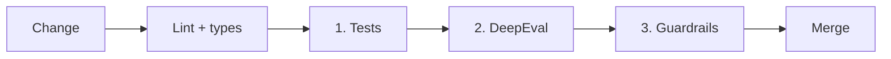

# Quality Gates

Every feature slice passes three gates in order. CI enforces all of them; a failure blocks merge.



## Gate 0 — Lint and Types

| Tool | Scope | Rule |
| --- | --- | --- |
| `ruff check` + `ruff format --check` | Python | Zero findings |
| `mypy --strict` | Python | Zero errors |
| `eslint` + `prettier --check` | TypeScript | Zero findings |
| `tsc --noEmit` | TypeScript | Zero errors |
| `gitleaks` | Repo | No secrets detected |

## Gate 1 — Tests

Deterministic tests only: no live LLM calls and no live network.

| Layer | Tooling | Minimum coverage |
| --- | --- | --- |
| `packages/domain` | pytest, Hypothesis | 95% |
| `mcp-servers/*` | pytest, respx (recorded HTTP fixtures) | 90% |
| `apps/api` | pytest, pytest-asyncio, fake LLM, stubbed MCP tools | 85% |
| `apps/web` | Vitest + Testing Library; Playwright for E2E | Critical flows covered |

Required test types:

- **Unit:** domain validation, graph node logic, guard behavior.
- **Contract:** MCP tool input/output schemas and error envelopes.
- **Integration:** API + database (SQLite and Postgres), graph with stubbed tools.
- **E2E:** each user-facing flow listed in the phase exit criteria.

## Gate 2 — DeepEval

LLM behavior is evaluated against golden datasets in `evals/`. Real models are used here, configured by `EVAL_JUDGE_MODEL` and `LLM_PRIMARY_MODEL`.

### When it runs
- On PRs that touch prompts, agents, graph nodes, guardrails, or model config.
- Nightly on `main` for drift detection.

### Structure
```text
evals/
  datasets/<feature>/*.jsonl   Golden inputs + expected properties
  metrics/                     Custom G-Eval and deterministic metrics
  suites/test_<feature>.py     DeepEval test cases (run via `deepeval test run`)
```

### Baseline metrics and thresholds

| Metric | Applies to | Threshold |
| --- | --- | --- |
| Schema validity (deterministic) | All structured outputs | 100% |
| Tool correctness | Agents that call MCP tools | ≥ 0.90 |
| Faithfulness (to tool outputs) | Weather, prices, availability claims | ≥ 0.90 |
| Answer relevancy | Conversational responses | ≥ 0.80 |
| Packing completeness (G-Eval) | Packing agent | ≥ 0.80 |
| Constraint adherence (G-Eval) | Itinerary and research agents | ≥ 0.85 |
| Hallucination | All agents | ≤ 0.10 |

Rules:
- Thresholds can only be lowered with an ADR.
- Every production bug involving LLM behavior adds a case to the relevant dataset.
- Eval results are stored as CI artifacts for comparison between runs.

## Gate 3 — Guardrails

Guards run at three boundaries. They are implemented with Guardrails AI validators plus deterministic code-level policies, registered in a single guard registry in `apps/api`.

| Boundary | Guard | Behavior on failure |
| --- | --- | --- |
| **Input** (user → agent) | Prompt-injection detection | Reject with safe message |
| | Off-topic / unsafe content | Reject or redirect |
| | PII detection and redaction before model calls | Redact, continue |
| **Tool output** (MCP → agent) | Treat as untrusted; strip instructions, enforce schema | Drop field or fail tool call |
| **Output** (agent → user) | Schema validation against domain models | Re-ask once, then fail visibly |
| | No invented facts: weather/prices must trace to tool results | Fail visibly |
| | PII leakage check | Redact |
| **Action** (agent → booking) | Valid, user-bound, unexpired approval token required | Hard block, audit log |

Rules:
- Action guards are enforced in code. Prompt instructions are never the only control.
- Every guard has unit tests for pass, fail, and edge cases, plus a red-team dataset in `evals/`.
- Guard failures are logged with trace IDs and surfaced to the user, never silently swallowed.
